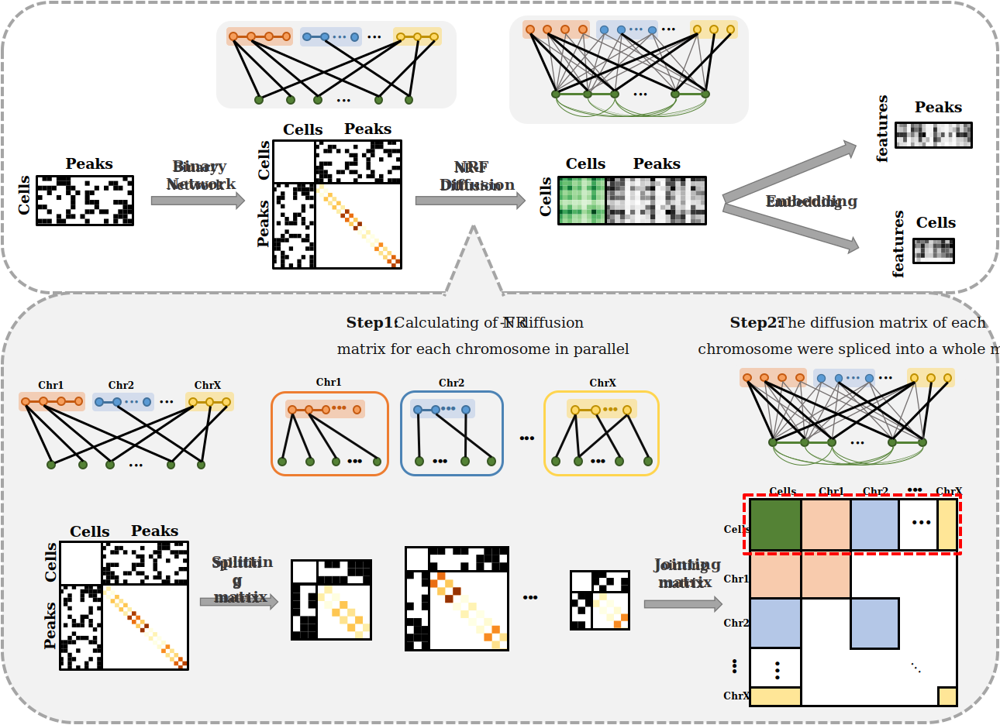

# SCARP (Network Reinforcement with Peaks Location Information)

Single-Cell ATAC-seq Analysis via Network Reinforcement with Peaks Location Information




## Directory structure
```
.
│  README.md
├─Exp1_Benchmark
│  │ Test.ipynb    
│  ├─figures   
│  ├─Processed data     
│  ├─Raw data     
│  └─Results
│          
├─Exp2_Robustness
├─Exp3_SNARE_seq
├─Exp4_SOX10_Knockdown
├─Exp5_10X_Multiome                            # 
│  │  README.md                                # instructions about how to download data
│  │  S01_Data_Preprocessing.ipynb             # Running to preprocess data
│  │  S02_Run_SCARP.ipynb                      # Runnung to 
│  │  S03_PCHIC.ipynb
│  │  S04_Chip_Seq.ipynb
│  │  S05_Differential_Analysis.ipynb    
│  ├─figures  
│  ├─Processed data     
│  ├─Raw data     
│  └─Results
│          
└─Scarp
    │  data_preprocessing.py
    │  downstream.py 
    └─ SCARP_help_func.py     

```


## Usage
### <font color=#2D82B7>Step1: Data Preprocessing</font>
#### running example:

### <font color=#2D82B7>Step2: Run SCARP</font>
#### (1) parameter clarificiation:
| parameter name | description           | type           | default |
| :------------- | :-------------------- | :------------- | :------ |
| data           | input scATAC-seq data | AnnData object | None    |
| m              |                       | float          | 1.5     |
| merge_thre     |                       | int            | 3000    |
| beta           |                       | float          | 1.5     |
| return_shape   |                       | str            | 'CN'    |
| peak_loc       |                       | int            | True    |
| parallel       |                       | int            | 0       |

  
#### (2) return clarificiation:
| parameter name | description        | type   |
| :------------- | :----------------- | :----- |
| t              | running time       | float  |
| diffusion_mat  | NR diffused matrix | matrix |


#### (3) running example:
```python
t, diffusion_mat = SCARP(data = adata,
                         m = 1.5,
                         merge_thre = 3000,
                         beta = 5000,
                         return_shape = 'CN',
                         peak_loc = True,
                         parallel = 0)
```

### <font color=#2D82B7>Step3: Compute Embedding Dimension</font>
#### running example:
```python
k = std_plot(data = diffusion_mat,
             title = 'Kept component',
             max_k = 50,
             plot_std = True,
             save_file = 'Kept component.svg')
```


## Tutorial


## Reproduce results
1. Follow instructions in each subfile to prepare the necessary data.
2. Run the code step by step.